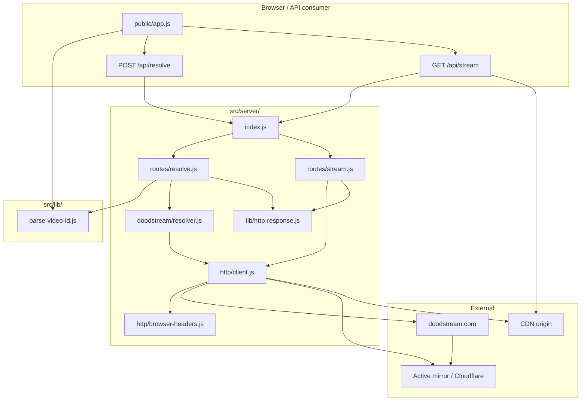
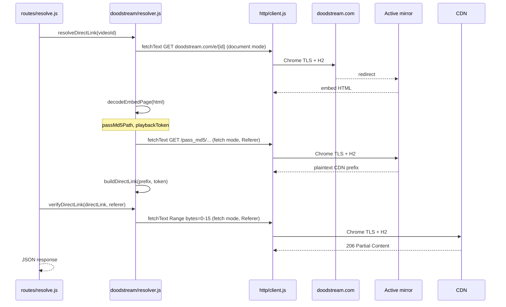

# DoodStream Direct Link Resolver

Zero-dependency Node.js service that resolves a DoodStream **video ID** to a direct CDN MP4 link. The implementation reverse-engineers the embed player handshake and replays it with a native Chrome-fingerprint HTTP client — no npm dependencies, no headless browser, no captcha automation.

## Stack

| Layer | Technology |
| --- | --- |
| Runtime | Node.js (ES modules) |
| HTTP server | `node:http` |
| Upstream client | `node:http2`, `node:https`, `node:tls`, `node:zlib` |
| Frontend | Static HTML/CSS/ES module (served by the same process) |

```bash
npm start          # node src/server/index.js
PORT=8787 npm start
```

Default listen address: `http://localhost:8787`

## Architecture



### Module map

```
/
├── public/
│   ├── index.html                Dev/test UI shell
│   ├── app.js                    Resolve client, live timers, copy links, proxy playback
│   └── app.css
└── src/
    ├── lib/
    │   └── parse-video-id.js     Video ID validation (shared by server + browser)
    └── server/
        ├── index.js              Entry point: API routing + static file server
        ├── lib/
        │   └── http-response.js  readJsonBody, sendJson
        ├── routes/
        │   ├── resolve.js        POST /api/resolve orchestration
        │   └── stream.js         GET /api/stream byte proxy
        ├── doodstream/
        │   └── resolver.js       Bootstrap, embed decode, pass_md5, direct link build
        └── http/
            ├── client.js         Chrome TLS + HTTP/2 client (fetchText, fetchStream)
            └── browser-headers.js document vs fetch header profiles
```

### Responsibilities

| Module | Role |
| --- | --- |
| `parse-video-id.js` | Single parser shared by server route and browser client for consistent validation |
| `src/server/index.js` | Routes `POST /api/resolve`, `GET /api/stream`, serves `public/` and `src/lib/` at `/lib/*` |
| `routes/resolve.js` | Parses `videoId`, calls resolver, verifies link, returns JSON |
| `routes/stream.js` | Proxies CDN range requests with injected `Referer` |
| `doodstream/resolver.js` | Implements the DoodStream embed → CDN URL protocol |
| `http/client.js` | All upstream HTTPS; session pooling; H2 primary, H1 fallback |
| `http/browser-headers.js` | Chrome 131 UA + `sec-*` headers for document and XHR-like modes |
| `public/app.js` | Integration reference for the two API endpoints |

## Resolve pipeline

DoodStream serves plain `video/mp4` on the CDN. Access control is at **URL discovery** and **CDN Referer checks**, not stream encryption.



### Step-by-step (resolver.js)

1. **`GET https://doodstream.com/e/{videoId}`** — document headers; follows redirects to the active mirror; canonical origin taken from the final URL.
2. **`decodeEmbedPage(html)`** — regex extraction of:
   - `/pass_md5/{hash}/{token}` path (inline `$.get`, quoted string, or bare path)
   - playback token from `makePlay()` query string or pass_md5 path segment
3. **`GET {origin}{passMd5Path}`** — fetch headers; `Referer: {origin}/e/{videoId}`.
4. **`decodePassMd5Response(body)`** — body is either:
   - plaintext `https://...` CDN prefix
   - `RELOAD` → session expired
   - non-URL text → rate limit / token reuse
5. **`buildDirectLink(cdnPrefix, token)`** — mirrors site player: 10 random `[A-Za-z0-9]` + `?token={token}&expiry={Date.now()}`.
6. **`verifyDirectLink`** — `Range: bytes=0-15` against CDN with `Referer: {origin}/`; requires HTTP 200 or 206; reads total size from `Content-Range`.

No WASM, no secondary decrypt pass on media bytes.

### Mirror discovery

No mirror URL or environment variable is required. `doodstream.com/e/{videoId}` redirects to whichever mirror currently hosts the embed (for example `playmogo.com`). The resolver uses the redirected origin for `pass_md5` and sets `referer` to `{origin}/`.

## HTTP client and Cloudflare

Mirror hosts reject default Node/curl TLS fingerprints with **403**. `http/client.js` impersonates Chrome at the transport layer:

| Mechanism | Implementation |
| --- | --- |
| TLS ciphers | Chrome cipher suite order via `tls.connect` |
| TLS extensions | `SSL_OP_TLSEXT_PADDING`, `SSL_OP_NO_ENCRYPT_THEN_MAC`, X25519/P-256 curves |
| ALPN | `h2`, `http/1.1` |
| HTTP/2 | Chrome SETTINGS (window 6291456, max streams 1000, etc.) |
| Sessions | Per-origin H2 session cache in `sessions` Map |
| Fallback | H2 failure → H1 with same TLS profile |
| Headers | `documentHeaders()` for page loads; `fetchHeaders()` for API/CDN |
| Compression | br/gzip on buffered text (`fetchText`); br/gzip/deflate on streams (`fetchStream`) |

`fetchText(url, extraHeaders, mode)` — buffered response for HTML and pass_md5; follows redirects.  
`fetchStream(url, extraHeaders)` — streaming response for CDN proxy; forwards `Range`.

## Stream proxy

The CDN enforces **`Referer: {mirror-origin}/`**. Browsers cannot set a cross-origin Referer on `<video src>`, so in-page playback uses a local relay:

```
GET /api/stream?url={encodeURIComponent(directLink)}&referer={encodeURIComponent(referer)}
```

`routes/stream.js` forwards the browser's `Range` header, fetches upstream via `fetchStream`, and pipes bytes back with `Content-Range` / `Content-Length` preserved.

Direct CDN access (outside the browser) only requires attaching the `referer` field from the resolve response.

## API contract

### `POST /api/resolve`

Request:

```http
POST /api/resolve
Content-Type: application/json

{"videoId": "5x50byl1sld3"}
```

Success `200`:

```json
{
  "videoId": "5x50byl1sld3",
  "title": "string | null",
  "directLink": "https://cdn.../....mp4?token=...&expiry=...",
  "referer": "https://playmogo.com/",
  "contentLength": "399715618"
}
```

Errors:

| Status | Cause |
| --- | --- |
| `400` | Invalid video ID, missing embed data, pass_md5 failure, verification error |
| `502` | CDN verification returned non-200/206 |

### `GET /api/stream`

Query params: `url` (direct CDN link), `referer` (from resolve response).

Forwards `Range` from client. Returns upstream status and video headers. `502` on upstream failure.

## Frontend integration (public/app.js)

Reference flow for consumers building on the API:

1. Validate with `parseVideoId` from `/lib/parse-video-id.js`
2. `POST /api/resolve` with `{ videoId }` → receive `directLink`, `referer`, `contentLength`
3. **Direct use:** pass `directLink` + `Referer: referer` to any HTTP client
4. **Browser playback:** set `<video src>` to `/api/stream?url=...&referer=...` (same-origin proxy)

The bundled UI shows live resolve and playback-start timers while work is in progress.

## Development notes

- **Zero deps:** no `package-lock.json`; nothing to install beyond Node.
- **Token single-use:** pass_md5 tokens and direct links can fail on retry; resolve fresh per attempt.
- **Video ID only:** input is the alphanumeric file code (for example `5x50byl1sld3`), not a full mirror URL.
- **Static serving:** `src/server/index.js` exposes `public/` at root paths and `src/lib/` at `/lib/*` for shared browser modules.

## Disclaimer

This repository is provided for **educational and research purposes** only, to document embed-player URL resolution, TLS client fingerprinting, and CDN access patterns. You are responsible for compliance with applicable laws, site terms of service, and copyright in your jurisdiction. Do not use this code to access, redistribute, or monetize content without authorization. The authors assume no liability for misuse.
